# Testes de Unidade e de Integração: Por que são Complementares?

Durante minha carreira, várias vezes me deparei com times em que a separação entre o que é um teste de integração e um teste de unidade não estavam muito clara para as pessoas que estavam ali escrevendo esses testes e isso sempre rende discussões muito interessantes. Neste artigo vou tentar simplificar um pouco essa discussão mas tentar trazer as informações que sempre trago nessas conversas.

Testes automatizados são fundamentais para garantir qualidade, reduzir falhas em produção e permitir evolução contínua do sistema. Dois tipos de testes se destacam nesse processo: testes de unidade e testes de integração.
Apesar de complementares, cada um possui um objetivo diferente e deve ser aplicado em momentos distintos do ciclo de desenvolvimento.

Neste artigo utilizarei uma API de gravação de pedidos feito em C# mas podemos os conceitos podem ser considerados para outras tecnologias.

## O que são os testes de unidade?

Os **testes de unidade** têm como objetivo verificar **pequenas partes isoladas do código** — geralmente uma função, método ou classe.

### Características dos testes de unidade

- Escopo reduzido.
- Executam rapidamente.
- Usam **mocks** para simular dependências externas.
- Identificam erros logo na fase inicial do desenvolvimento.

### Exemplo: `CalculadorDescontoService`

```csharp
public interface ICalculadorDescontoService
{
    decimal Calcular(decimal valor, decimal percentual);
}

public class CalculadorDescontoService : ICalculadorDescontoService
{
    public decimal Calcular(decimal valor, decimal percentual)
    {
        if (percentual < 0 || percentual > 1)
            throw new ArgumentException("Percentual deve estar entre 0 e 1");

        return valor - (valor * percentual);
    }
}
```

**Teste de unidade para o método `Calcular`**

```csharp
[Fact]
public void Calcular_DeveAplicarDescontoCorretamente()
{
    // Arrange
    ICalculadorDescontoService service = new CalculadorDescontoService();

    // Act
    var resultado = service.Calcular(100, 0.1m); // 10% de desconto

    // Assert
    Assert.Equal(90, resultado);
}

[Theory]
[InlineData(-0.1)] // menor que 0
[InlineData(1.1)]  // maior que 1
public void Calcular_DeveLancarExcecao_SePercentualForaDoRange(decimal percentualInvalido)
{
    // Arrange
    ICalculadorDescontoService service = new CalculadorDescontoService();

    // Act & Assert
    Assert.Throws<ArgumentException>(() => service.Calcular(100, percentualInvalido));
}

```

👉 Aqui validamos apenas a lógica interna do serviço, sem dependências externas.

### Exemplo: `PedidoService`

```csharp
public class PedidoService
{
    private readonly IPedidoRepository _repo;
    private readonly ICalculadorDescontoService _calculador;

    public PedidoService(IPedidoRepository repo, ICalculadorDescontoService calculador)
    {
        _repo = repo;
        _calculador = calculador;
    }

    public void CriarPedido(Pedido pedido, decimal percentualDesconto)
    {
        if (pedido.Valor <= 0)
            throw new ArgumentException("Pedido inválido");

        // ⚠️ Bug: interpreta 10% como "10.0" em vez de "0.1"
        var valorComDesconto = _calculador.Calcular(pedido.Valor, percentualDesconto);

        var pedidoComDesconto = pedido with { Valor = valorComDesconto };
        _repo.Salvar(pedidoComDesconto);
    }
}
```

**Teste do método `CriarPedido` (mockando o ICalculadorDescontoService)**

```csharp
[Fact]
public void CriarPedido_DeveSalvarComDesconto()
{
    var repoMock = new Mock<IPedidoRepository>();
    var calculadorMock = new Mock<ICalculadorDescontoService>();

    var service = new PedidoService(repoMock.Object, calculadorMock.Object);

    var pedido = new Pedido(1, "Maria", 100);

    // O mock devolve 90 independentemente do percentual
    calculadorMock
        .Setup(c => c.Calcular(100, It.IsAny<decimal>()))
        .Returns(90);

    service.CriarPedido(pedido, 10.0m); // ⚠️ Passa 10 em vez de 0.1

    repoMock.Verify(r => r.Salvar(It.Is<Pedido>(p => p.Valor == 90)));
}
```

👉 Esse teste passa normalmente, porque o mock não se importa se o percentual foi 10.0 ou 0.1.
Ou seja: se só houvessem testes de unidade, o bug não seria detectado.

---

## O que são Testes de Integração?

Os **testes de integração** validam se diferentes partes do sistema funcionam corretamente quando trabalham juntas. Ou seja, verificam se os componentes se comunicam de forma correta.

### Características dos testes de integração

- Escopo mais amplo.
- Mais lentos que os testes de unidade.
- **Usam implementações reais em vez de mocks.**
- Detectam falhas de comunicação entre módulos.

### Exemplo: Teste de integração juntando `PedidoService` e `CalculadorDescontoService`

```csharp
[Fact]
public void CriarPedido_ComDescontoDe10PorCento_DeveSalvarComValor90()
{
    var repo = new PedidoRepository(new List<Pedido>());
    ICalculadorDescontoService calculador = new CalculadorDescontoService();
    var service = new PedidoService(repo, calculador);

    var pedido = new Pedido(1, "Maria", 100);

    service.CriarPedido(pedido, 10.0m); // ⚠️ Bug: deveria ser 0.1

    var pedidoSalvo = repo.BuscarPorCliente("Maria");

    Assert.NotNull(pedidoSalvo);
    Assert.Equal(90, pedidoSalvo!.Valor); // ❌ FALHA: valor incorreto
}
```

👉 Aqui o teste falha, mostrando que o PedidoService e o CalculadorDescontoService não concordam sobre o formato do percentual.

---

## Porque os dois são Complementares?

- O teste de unidade do PedidoService passa, mesmo que ele esteja passando 10.0 em vez de 0.1.
- O teste de unidade do CalculadorDescontoService também passa, porque ele sozinho funciona bem.
- Somente o teste de integração revela o problema, pois verifica a comunicação entre os dois serviços.



👉 Se dependêssemos apenas de testes de unidade, esse bug de contrato passaria despercebido.

---

## Conclusão

- Testes de unidade: garantem que cada componente funciona isoladamente.
- Testes de integração: garantem que os componentes funcionam corretamente juntos.
- Complementares: os dois são necessários, porque cada um cobre riscos diferentes.


📌 Portanto, uma boa estratégia é manter muitos testes de unidade (rápidos e baratos) e também alguns testes de integração (mais caros, mas essenciais para detectar falhas entre serviços).
